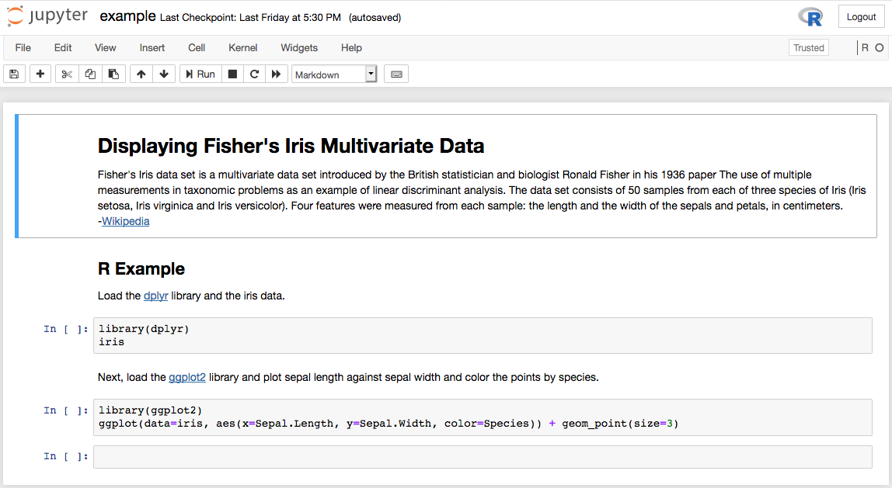

# macOS
## Setting Up: Increase the Number of File Handlers
Building an installer requires opening many files. The default numner of file hnadlers for macOS is 256 which is insufficient. Use `ulimit` to check the number of file handlers.
```
$ ulimit -n
256
```
To increase the number of file handlers copy the `limit.maxfiles.plist` to `/Library/LaunchDaemons/` as root.
```
$ sudo cp limit.maxfiles.plist /Library/LaunchDaemons/
```
Reboot the computer to set the maximum number of file handlers.

## Constructor File

The constructor file specifies a number of keys:

```
install_in_dependency_order: True 
installer_filename: conda-R.pkg 
initialize_by_default: True 
installer_type: pkg  [osx] 
license_file: ../EULA.txt
```
Note that the conda environment is initialized in install, this means that installing it will overwrite the conda initialization script if Anconda or Miniconda are installed.

## Building the Installer

In the terminal:
```
(base) $ cd ~/<path-to-repo>/condaR/linux
(base) $ constructor .
```
The installer will be written to the working directory

## Installing and Starting

Install by double clicking on the conda-R.pkg in the Finder or use the command line shell.
```
$ open conda-R.pkg
```
To initialize conda-R, reload .bash_profile
```
$ source ~/.bash_profile
(base) $
```
## Running R in Jupyter Notebook
To run the example notebook:
```
(base) $ jupyter notebook /Users/<username>/path-to-repo/condaR/example.ipynb
```
The notebook will open in a browser.


