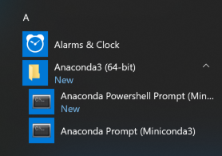
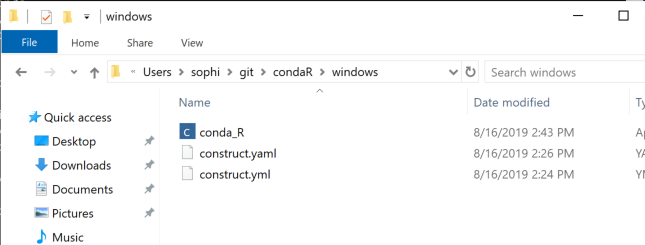
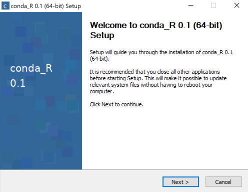
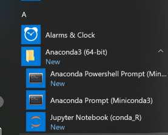

# Linux

## Constructor File

Windows requires additiona packages from msys2, note that this channel is added for the Windows installer.
```
channels:
  - https://repo.anaconda.com/pkgs/main/
  - https://repo.anaconda.com/pkgs/r/
  - https://repo.anaconda.com/pkgs/msys2/
```

The constructor file specifies a number of keys:

```
install_in_dependency_order: True 
installer_filename: conda-R.sh 
initialize_by_default: True 
installer_type: exe  [win] 
license_file: ../EULA.txt
```
Note that the conda environment is initialized in install, this means that installing it will overwrite the conda initialization script if Anconda or Miniconda are installed.

## Building the Installer
To build the installer, click on the Anaconda Promopt in the Start Menu



In the Anaconda Prompt:
```
(base) c:\Users\user> cd %HOMEPATH%\<path-to-repo>\condaR\window
(base) c:\Users\user> constructor .
```
The installer will be written to the working directory
## Installing

Install by double clicking on the conda-R.exe in File Explorer.



Follow the installer prompts.



## Running R in Jupyter Notebook
To run the example notebook clcik on the conda-R in Start Menu.



The application will open a browser window to Jupyter, navigate to the repository to open the example notebook. 


